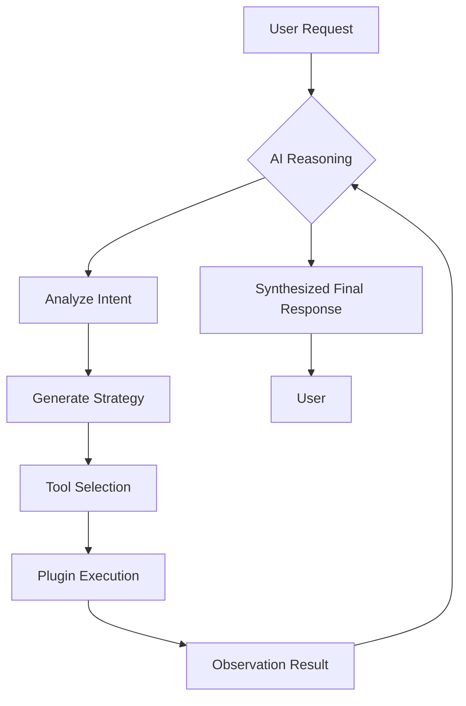

<div align="center">
  
  <br />
  <h1>Ferro</h1>
  <p>An Autonomous Agentic Telegram Framework</p>

  <p>
    
    
    
    
  </p>

  [](https://github.com/1dev-hridoy/ferro/stargazers)
  [](https://github.com/1dev-hridoy/ferro/network/members)
  [](LICENSE)
</div>

---

## 📖 Overview

Ferro is a sophisticated, agent-centric Telegram bot framework designed for autonomous task execution. Unlike conventional bots that follow rigid command-response patterns, Ferro utilizes an **Autonomous Reasoning Loop** to interpret complex user goals, synthesize execution plans, and iteratively use specialized tools (plugins) to deliver high-fidelity results.

## � Table of Contents

- [Overview](#-overview)
- [Repository Analytics](#-repository-analytics)
- [Key Features](#-key-features)
- [Tech Stack](#-tech-stack)
- [Core Architecture](#-core-architecture)
- [Getting Started](#-getting-started)
  - [Prerequisites](#1-prerequisites)
  - [Obtain Ferro API Key](#2-obtain-ferro-api-key)
  - [Installation](#3-installation)
  - [Interactive Setup](#4-interactive-setup)
- [CLI Commands](#-cli-commands)
- [Development Guides](#-development-guides)
- [Security & Safety](#-security--safety)
- [License](#-license)


---

## 🚀 Key Features

- **Recursive Reasoning**: Leverages advanced LLM logic (GPT, Llama, Qwen) to self-correct during complex tasks.
- **Pluggable Architecture**: Modular plugin system for seamless expansion (Web Search, File Ops, Code Exec, Reminders).
- **Managed Execution**: Secure environment for running shell commands and JavaScript snippets.
- **Contextual Memory**: Intelligent retention of conversation history via a local JSON database.
- **Real-time Observability**: Interactive CLI and progress indicators for AI planning visibility.

---

## 🏗️ Core Architecture

Ferro operates on a recursive loop that mimics human problem-solving:



---

## 🚦 Getting Started

### 1. Prerequisites
- **Node.js**: LTS version 18 or higher is required.
- **Package Manager**: NPM, PNPM, or Yarn.
- **Telegram Bot Token**: Get one from [@BotFather](https://t.me/BotFather).
- **Owner ID**: Your numeric Telegram User ID (Get it from [@userinfobot](https://t.me/userinfobot)).

### 2. Obtain Ferro API Key
Ferro requires a specialized reasoning API key to power its decision-making logic:
1. Visit [ferro.my.id](https://ferro.my.id/) and **Login with GitHub**.
2. Navigate to your **Dashboard**.
3. Generate and copy your **API Key**.

### 3. Installation
```bash
# Clone the repository
git clone https://github.com/1dev-hridoy/ferro.git
cd ferro

# Install dependencies
npm install
```

### 4. Interactive Setup
Ferro features a built-in interactive setup wizard. To begin, simply run:

```bash
npm start
```

The wizard will guide you through the following configuration:
- **Agent Name**: The display name of your AI agent.
- **AI Model**: Selection from high-performance models (GPT-OSS-120B, Llama-3.1, Qwen-3, etc.).
- **Owner Name**: Your primary alias.
- **Owner UID**: Your numeric Telegram ID (for administrative control).
- **Ferro API Key**: Your personal key from the dashboard.
- **Telegram Bot Token**: The token for your bot.

---

## 🛠️ Tech Stack

- **Runtime**: Node.js
- **Bot Framework**: Telegraf
- **AI Integration**: Ferro AI Reasoning Engine
- **Data Persistence**: JSON-based Flat File DB
- **UI/UX**: Ora (spinners), Chalk (colors), Inquirer (setup wizard)

---

## ⌨️ CLI Commands

| Command | Description | Access | 
| :--- | :--- | :--- |
| `/start` | Initializes the agent session | All Users |
| `/clear` | Purges current conversation history | All Users |
| `/persona` | Configures the agent's behavior/personality | All Users |
| `/system` | Retrieves real-time server metrics | All Users |
| `/restart` | Recycles the bot process | Owner Only |

---

## 👨‍💻 Development Guides

Developers can extend Ferro's capabilities by following these modules:

- [⌨️ Command Development](doc/how-to-make-commands.md)
- [📦 Plugin Integration](doc/how-to-make-plugins.md)

---

## 🛡️ Security & Safety

> [!CAUTION]
> The `code_exec` plugin provides high-level access to the host environment. While whitelisting is implemented, it is recommended to run the bot in a containerized or sandboxed environment. **Never share your `.env` file.**

---

<div align="center">
  <h3>Connect with the Creator</h3>
  <p>
    <a href="https://github.com/1dev-hridoy"></a>
    <a href="https://t.me/BD_NOOBRA"></a>
  </p>
  <p>Built with ❤️ by <b>1dev-hridoy</b></p>
</div>
